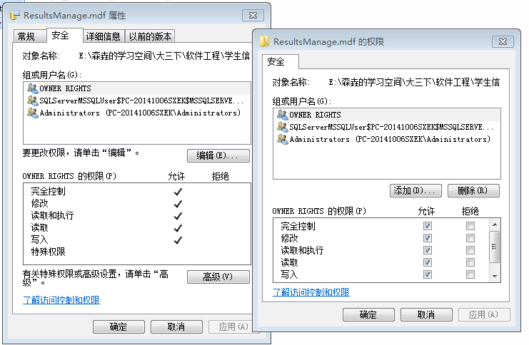
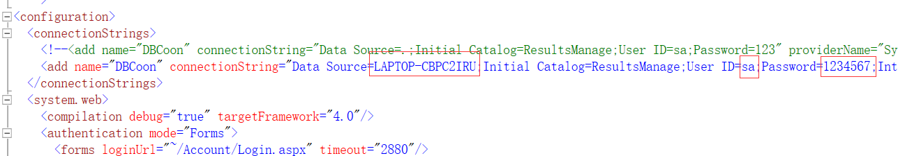

# Educational-administration-system
The educational management system which is coded by Asp.net

## 使用说明

1)   数据库附加

首先找到数据库文件和日志文件，修改这两个文件的操作权限为完全控制：

点击开始->程序->Microsoft SQL Server 2012->SQL Server Management Studio，选择SQL Server验证登录，连接后右键点击数据库，菜单中点击附加，在对话框中点击添加，进入系统的文件夹，选择ResultsManage.mdf，确定。数据库下出现ResultsManage即数据库文件附加成功。

2)   修改配置文件

打开网站目录，将web.config文件中的以下三处修改为自己电脑数据库所对应的名称、用户名和密码即可：

